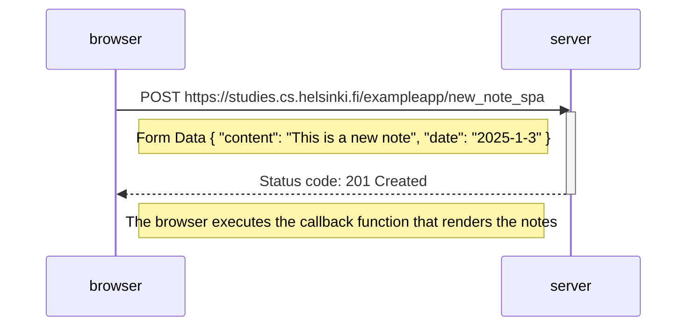

### Sequence diagram

```
sequenceDiagram
    participant browser
    participant server

    browser->>server: POST https://studies.cs.helsinki.fi/exampleapp/new_note_spa  
    activate server
    Note right of browser: Form Data { "content": "This is a new note", "date": "2025-1-3" }
    server-->>browser: Status code:    201 Created
    deactivate server

    Note right of browser: The browser executes the callback function that renders the notes

```


